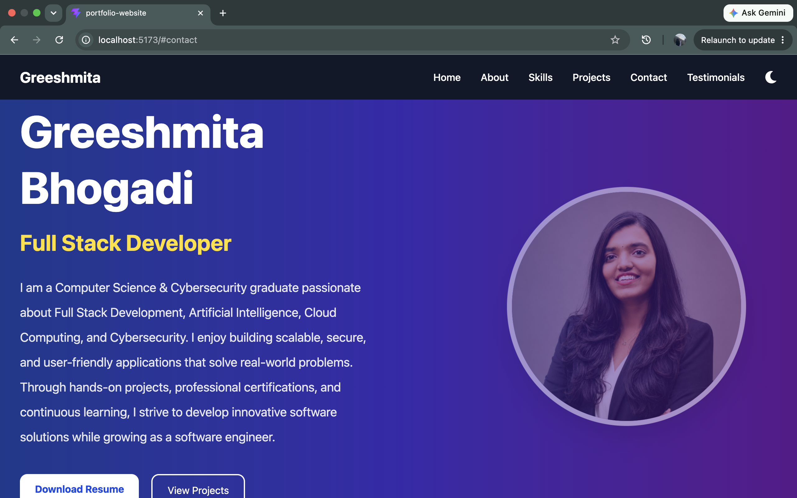
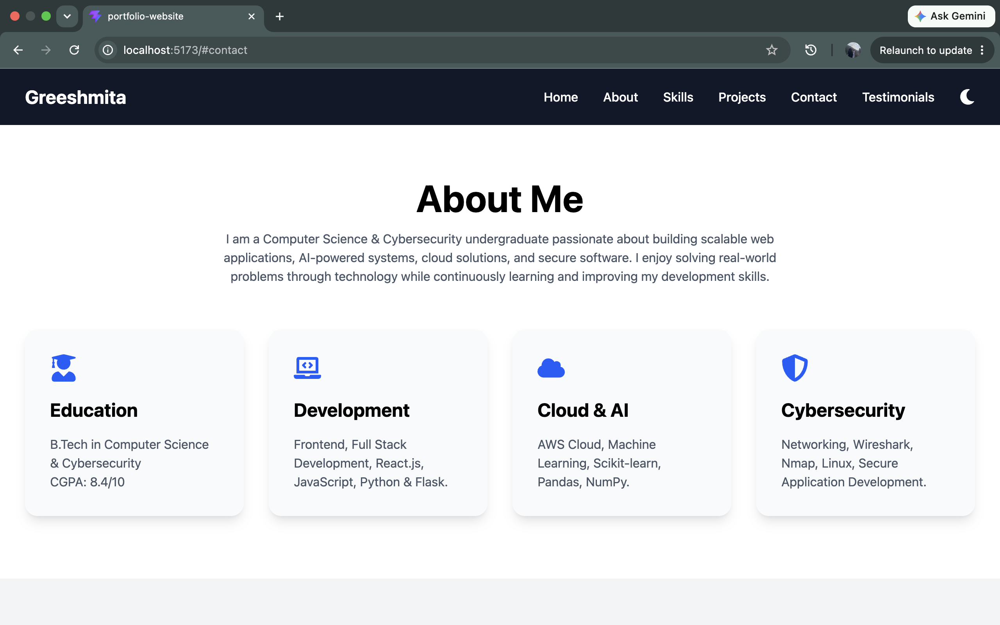
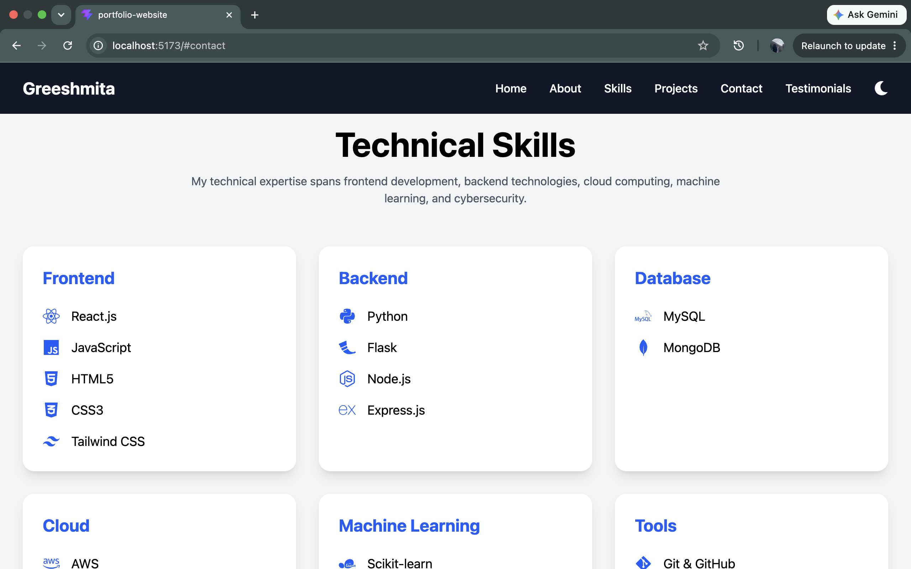
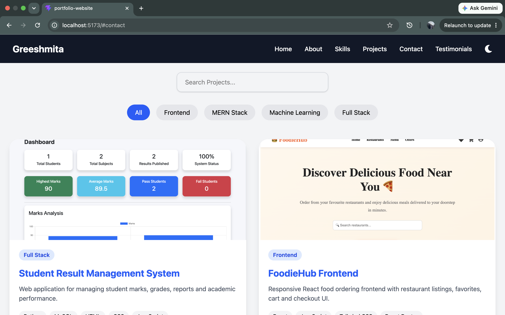
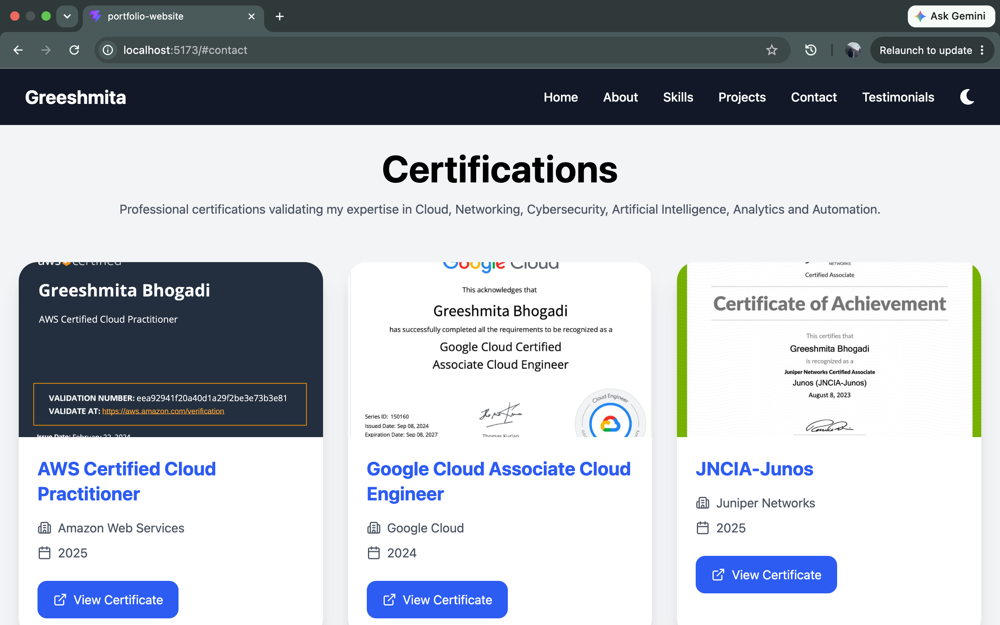
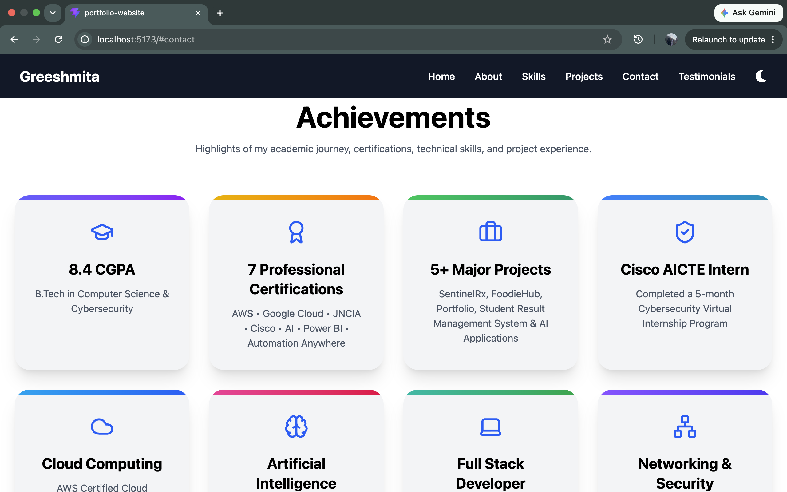
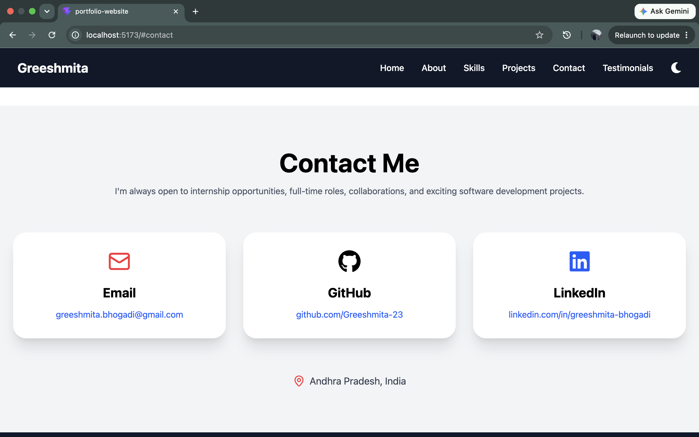

# 🌐 Greeshmita Bhogadi | Personal Portfolio Website

<div align="center">


A modern, responsive, and interactive personal portfolio built with **React.js**, **Vite**, **Tailwind CSS**, and **Framer Motion** to showcase my skills, projects, certifications, achievements, and professional journey.

</div>

---

# 📖 About

This portfolio serves as my personal website where recruiters and developers can learn more about me, explore my projects, view my certifications, download my resume, and connect with me.

It is designed with a modern UI, smooth animations, responsive layouts, and a clean user experience.

---

# 🚀 Live Demo

> 🔗 **Coming Soon (Vercel Deployment)**

---

# 📸 Portfolio Preview

## 🏠 Home



---

## 👤 About



---

## 💻 Skills



---

## 🚀 Projects



---

## 🏆 Certificates



---

## 🎯 Achievements



---

## 📩 Contact



---

# ✨ Features

- 🎨 Modern UI Design
- 📱 Fully Responsive
- 🌙 Dark / Light Mode
- ⚡ Fast Performance using Vite
- 🎭 Smooth Animations using Framer Motion
- 👤 Professional Hero Section
- 📖 About Me
- 💻 Technical Skills
- 💼 Experience Timeline
- 🏆 Certifications
- 🎯 Achievements
- 📂 Projects Showcase
- 📊 GitHub Statistics
- 📁 GitHub Repositories
- 📄 Resume Download
- 📬 Contact Section
- 🔗 Social Media Links

---

# 🛠️ Tech Stack

### Frontend

- React.js
- JavaScript (ES6+)
- Vite

### Styling

- Tailwind CSS
- CSS3

### Libraries

- Framer Motion
- React Icons
- Lucide React

### Tools

- Git
- GitHub
- VS Code

### Deployment

- Vercel

---

# 📂 Project Structure

```text
portfolio-website
│
├── public
│   ├── profile.png
│   ├── resume.pdf
│
├── screenshots
│   ├── home.png
│   ├── about.png
│   ├── skills.png
│   ├── projects.png
│   ├── certificates.png
│   ├── achievements.png
│   └── contact.png
│
├── src
│   ├── assets
│   │   ├── images
│   │   └── certificates
│   │
│   ├── components
│   │   ├── Navbar.jsx
│   │   ├── Hero.jsx
│   │   ├── About.jsx
│   │   ├── Skills.jsx
│   │   ├── Experience.jsx
│   │   ├── Certificates.jsx
│   │   ├── Achievements.jsx
│   │   ├── Projects.jsx
│   │   ├── GitHubProjects.jsx
│   │   ├── GithubStats.jsx
│   │   ├── Resume.jsx
│   │   ├── Contact.jsx
│   │   └── Footer.jsx
│   │
│   ├── App.jsx
│   ├── main.jsx
│   └── index.css
│
├── package.json
└── README.md
```

---

# ⚙️ Installation

### Clone the repository

```bash
git clone https://github.com/Greeshmita-23/portfolio-website.git
```

---

### Navigate to the project

```bash
cd portfolio-website
```

---

### Install dependencies

```bash
npm install
```

---

### Start the development server

```bash
npm run dev
```

---

### Build for production

```bash
npm run build
```

---

# 👩‍💻 About Me

I am a **Computer Science & Cybersecurity undergraduate** passionate about building modern, scalable, and user-friendly applications.

My areas of interest include:

- 🌐 Frontend Development
- 💻 Full Stack Development
- ☁️ Cloud Computing
- 🤖 Artificial Intelligence
- 🔐 Cybersecurity

I enjoy continuously learning new technologies and building projects that solve real-world problems.

---

# 📬 Contact

📧 **Email**

greeshmita.bhogadi@gmail.com

🐙 **GitHub**

https://github.com/Greeshmita-23

💼 **LinkedIn**

https://linkedin.com/in/greeshmita-bhogadi

---

# 🤝 Connect With Me

If you like this project, feel free to connect with me on GitHub or LinkedIn.

I'm always open to:

- Internship Opportunities
- Full-Time Roles
- Open Source Contributions
- Software Development Collaborations

---

# 👩‍💻 Developed By

## **Greeshmita Bhogadi**

🎓 B.Tech – Computer Science & Engineering
